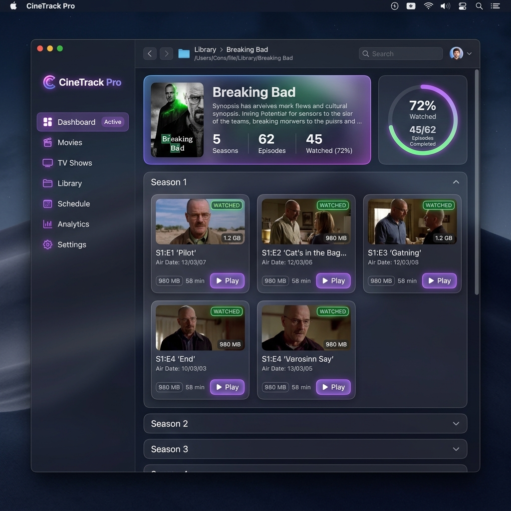
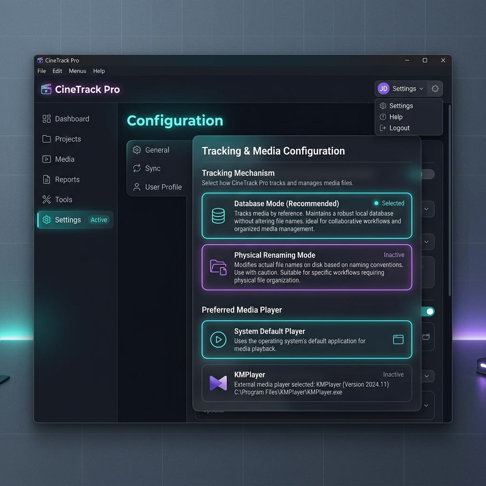

# 🎬 CineTrack Pro — TV Series Progress Manager & Media Suite

[](https://www.electronjs.org/)
[](https://nodejs.org/)
[](https://developer.mozilla.org/en-US/docs/Web/JavaScript)
[](#)

**CineTrack Pro** is a sleek, high-performance desktop application built to solve a common frustration for media enthusiasts: **losing track of watched episodes in TV series folders containing hundreds of files (500+ episodes)**.

---

## 📷 Application Screenshots

### 📊 Dashboard & Progress Tracking


### ⚙️ Application & Player Settings


---

## ✨ Features

- 📁 **Automated Directory Scanning**: Recursively scans local TV show directories, parsing seasons and episode numbers regardless of file structures.
- ⚡ **Built for Scale (500+ Episodes)**: Intelligent accordion-style season grouping. Automatically expands the season you are currently watching while collapsing finished or future seasons for lightning-fast performance.
- 🔄 **Dual Progress Tracking Modes**:
  - **Database Mode (Recommended)**: Tracks viewing progress via a lightweight `.episode-tracker.json` file inside the media folder. Keeps original files pristine (ideal for active torrent seeding and media center scraping like Plex/Jellyfin).
  - **Physical Renaming Mode**: Appends a custom tag (e.g., ` [Finished]`) directly to physical file names on disk, making watched states visible directly inside Windows Explorer.
- ⏯️ **Integrated Media Player Launch**: Double-click or click **Play** to launch episodes directly. Supports:
  - **Windows Default Media Player** (VLC, MPC-HC, Movies & TV, etc.)
  - **KMPlayer Integration** (Auto-detects KMPlayer installation paths across program directories).
- ⚡ **Bulk Operations**: One-click actions to mark entire seasons or filtered lists as watched/unwatched.
- 🎨 **Rich Glassmorphism UI**: High-end dark theme design system built with custom HSL color palettes, responsive cards, and dynamic progress indicators.

---

## 🛠️ Tech Stack

- **Core Framework**: [Electron](https://www.electronjs.org/)
- **Backend/Main Process**: Node.js filesystem (`fs`), `child_process`, and IPC messaging.
- **Frontend**: Vanilla HTML5, modern CSS3 (Glassmorphism), ES6+ JavaScript.
- **Bundler/Packaging**: `electron-builder` (creates standalone Windows Setup `.exe` installers).

---

## 🚀 Getting Started

### Prerequisites

Ensure you have [Node.js](https://nodejs.org/) (v18 or higher) installed on your computer.

### Installation & Local Running

1. **Clone the Repository**:
   ```bash
   git clone https://github.com/your-username/movie-marker.git
   cd movie-marker
   ```

2. **Install Dependencies**:
   ```bash
   npm install
   ```

3. **Start Application in Developer Mode**:
   ```bash
   npm start
   ```

---

## 📦 Packaging as Standalone Desktop App (.exe)

To build a standalone Windows Installer setup file or a portable executable that can run on any Windows PC without requiring Node.js:

```bash
npm run dist
```

After building, navigate to the newly created `dist/` folder:
- 📦 **`CineTrack Pro Setup 1.0.0.exe`**: Standard Windows installer (creates Start Menu & Desktop shortcuts).
- 🚀 **`CineTrack Pro 1.0.0.exe`**: Portable version (runs immediately without installation).

---

## 📂 Project Structure

```
Movie marker/
├── main.js                 # Electron main process (IPC handlers, file I/O, player launcher)
├── preload.js              # Secure contextBridge exposing APIs to the renderer
├── index.html              # Main DOM layout and UI components
├── renderer.js             # UI state management, dashboard rendering, DOM events
├── styles.css              # Custom dark-theme glassmorphism CSS styling
├── package.json            # Dependencies, scripts, and electron-builder configurations
└── .gitignore              # Ignored build folders and node_modules
```

---

## 📄 License

This project is licensed under the ISC License. Feel free to modify and adapt for personal or commercial use.
